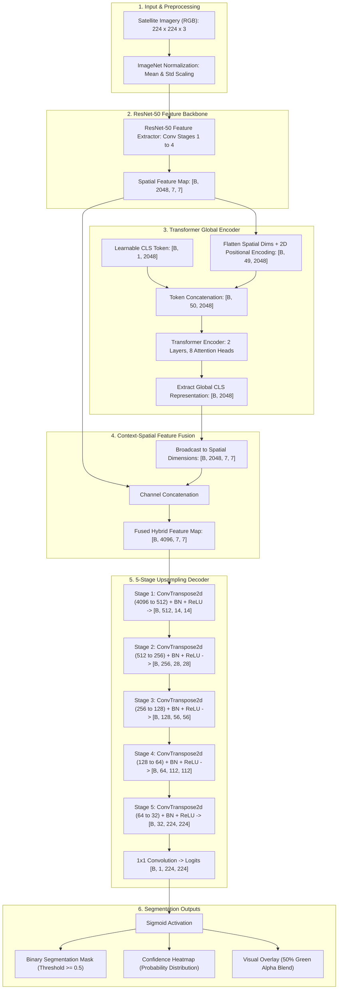

# MangroveNet — AI-Powered Mangrove Ecosystem Classification

[](https://www.python.org/)
[](https://pytorch.org/)
[](https://fastapi.tiangolo.com/)
[](https://streamlit.io/)
[](LICENSE)

**MangroveNet** is an end-to-end deep learning system engineered for high-precision semantic segmentation of mangrove vegetation in high-resolution satellite imagery (e.g., European Space Agency Sentinel-2). By unifying the localized spatial feature extraction of deep convolutional neural networks with the global contextual dependency modeling of Vision Transformers, MangroveNet produces accurate binary classification masks, calibrated confidence heatmaps, and geospatial visual overlays to empower coastal ecosystem conservation and monitoring.

---

## 📑 Table of Contents

- [🌿 Overview](#-overview)
- [✨ Key Features](#-key-features)
- [🏗️ System & Model Architecture](#️-system--model-architecture)
  - [Architecture Flowchart](#architecture-flowchart)
  - [TCCFNet Detailed Specifications](#tccfnet-detailed-specifications)
  - [Loss Function: BCEDiceLoss](#loss-function-bcediceloss)
- [💻 Tech Stack](#-tech-stack)
- [🖼️ Application Screenshots](#️-application-screenshots)
- [📁 Project Directory Structure](#-project-directory-structure)
- [🚀 Setup & Installation](#-setup--installation)
  - [1. Prerequisites](#1-prerequisites)
  - [2. Environment Configuration](#2-environment-configuration)
  - [3. Dependency Installation](#3-dependency-installation)
- [🖥️ Usage & Execution Modes](#️-usage--execution-modes)
  - [1. Single-Page Web Application (FastAPI)](#1-single-page-web-application-fastapi)
  - [2. Interactive Streamlit Dashboard](#2-interactive-streamlit-dashboard)
  - [3. Command-Line Inference (CLI)](#3-command-line-inference-cli)
  - [4. Model Training & Resuming](#4-model-training--resuming)
  - [5. Performance & Curve Visualization](#5-performance--curve-visualization)
- [🔌 REST API Documentation](#-rest-api-documentation)
  - [Endpoints Summary](#endpoints-summary)
  - [cURL Request Example](#curl-request-example)
  - [Sample JSON Response](#sample-json-response)
- [📊 Model Performance & Validation](#-model-performance--validation)
- [🤝 Contributing](#-contributing)
- [📜 License](#-license)

---

## 🌿 Overview

Mangrove forests are vital coastal carbon sinks and biodiversity hotspots, yet they face severe degradation from climate change, aquaculture expansion, and coastal development. Traditional satellite monitoring often struggles with optical variability across water-land interfaces and spectral similarities between mangrove canopy and terrestrial foliage.

MangroveNet resolves these challenges using **TCCFNet (Transformer-CNN Combined Feature Network)**:
1. **Local Textural Detail**: Extracted through a deep residual backbone (**ResNet-50**).
2. **Global Geospatial Context**: Captured using a multi-head **Transformer Encoder** equipped with learnable global tokens.
3. **Fullstack Delivery**: Served through a lightning-fast asynchronous **FastAPI** backend and an intuitive, responsive dark-themed browser interface, alongside a **Streamlit** dashboard and a scriptable **CLI**.

---

## ✨ Key Features

- 🛰️ **Multi-Format Satellite Ingestion**: Direct support for GeoTIFF, PNG, and JPEG imagery up to 15 MB.
- 🎯 **Pixel-Level Binary Segmentation**: Distinguishes dense mangrove canopy (class `1`) from background water bodies, tidal mudflats, and non-mangrove flora (class `0`).
- 🔥 **Calibrated Confidence Heatmaps**: Probability distributions derived from post-sigmoid activations for uncertainty analysis.
- 🌿 **Visual Alpha-Blended Overlays**: Instant 50% emerald-green overlay composite on top of the original satellite imagery.
- 📈 **Real-Time Coverage Analytics**: Automatic calculation of mangrove area percentage, total pixel counts, and sub-second inference latency.
- 🧩 **Large-Scene Tiling Engine**: Seamless processing of large satellite tiles via automated 224×224 sliding patch windows with overlap reconstruction.
- 🖥️ **Modern Responsive Web UI**: Single-page application with drag-and-drop file upload, live visual previews, and mask downloads.
- ⚡ **Streamlit Research Dashboard**: Built-in interactive dashboard tailored for rapid exploration and visual inspection.
- 💻 **Headless CLI Interface**: Production-ready command-line tool for batch processing and automated pipeline integrations.
- 🔄 **Production Training Suite**: Full training and validation pipeline featuring automated checkpointing, resume capability, and metric tracking.

---

## 🏗️ System & Model Architecture

### Architecture Flowchart



### TCCFNet Detailed Specifications

| Component | Layer / Operation | Input Dimensions | Output Dimensions | Description |
| :--- | :--- | :--- | :--- | :--- |
| **Input** | Normalization | `[B, 3, 224, 224]` | `[B, 3, 224, 224]` | ImageNet standard (μ, σ) |
| **Backbone** | ResNet-50 | `[B, 3, 224, 224]` | `[B, 2048, 7, 7]` | High-capacity spatial feature extraction |
| **Positional Encoding** | 2D Learnable Embeddings | `[B, 49, 2048]` | `[B, 49, 2048]` | Spatial relationship preservation |
| **CLS Token** | Learnable Parameter | `[1, 1, 2048]` | `[B, 50, 2048]` | Prepended token for holistic context |
| **Transformer Encoder** | 2 Layers, 8 Heads | `[B, 50, 2048]` | `[B, 2048]` | Long-range spatial dependency modeling |
| **Feature Fusion** | Broadcast & Concatenation | Spatial + Global | `[B, 4096, 7, 7]` | Combines localized textures with global context |
| **Decoder (5 Stages)** | ConvTranspose2d + BN + ReLU | `[B, 4096, 7, 7]` | `[B, 32, 224, 224]` | Progressive hierarchical upsampling |
| **Projection Head** | 1×1 Convolution | `[B, 32, 224, 224]` | `[B, 1, 224, 224]` | Pixel-level binary classification logits |

### Loss Function: BCEDiceLoss

To overcome severe foreground-background class imbalance inherent to remote sensing patches, MangroveNet utilizes a combined **BCEDiceLoss**:

$$\mathcal{L}_{\text{total}} = 0.5 \cdot \mathcal{L}_{\text{BCE}} + 0.5 \cdot \mathcal{L}_{\text{Dice}}$$

#### 1. Binary Cross-Entropy with Logits ($\mathcal{L}_{\text{BCE}}$)
Provides smooth gradient landscapes and numerical stability via integrated sigmoid activation:

$$\mathcal{L}_{\text{BCE}}(x, y) = -\frac{1}{N} \sum_{i=1}^{N} \left[ y_i \cdot \log(\sigma(x_i)) + (1 - y_i) \cdot \log(1 - \sigma(x_i)) \right]$$

#### 2. Soft Dice Loss ($\mathcal{L}_{\text{Dice}}$)
Directly maximizes the spatial overlap between predicted regions and ground truth masks:

$$\mathcal{L}_{\text{Dice}}(p, y) = 1 - \frac{2 \sum_{i=1}^{N} p_i y_i + \epsilon}{\sum_{i=1}^{N} p_i + \sum_{i=1}^{N} y_i + \epsilon}$$

*(where $p_i = \sigma(x_i)$ and $\epsilon = 10^{-6}$ is a smoothing coefficient preventing division by zero).*

---

## 💻 Tech Stack

| Layer | Technologies | Purpose |
| :--- | :--- | :--- |
| **Deep Learning** | PyTorch, Torchvision | Hybrid TCCFNet model definition, tensor ops, backpropagation |
| **Backend API** | FastAPI, Uvicorn, Python-Multipart | High-throughput asynchronous REST API service & static hosting |
| **Frontend UI** | HTML5, Modern CSS3, JavaScript ES6+ | Lightweight zero-dependency single-page application |
| **Alternative UI** | Streamlit | Interactive web dashboard for exploratory research |
| **Image Processing** | Pillow (PIL), NumPy | Image decoding, channel conversions, tiling & matrix manipulation |
| **Evaluation & Viz** | Scikit-learn, Matplotlib, Seaborn | Metric computation (IoU, Dice, F1), confusion matrix & training curves |

---

## 🖼️ Application Screenshots

> *Screenshots will be added after the first deployment. Run the app to see the live UI.*

---

## 📁 Project Directory Structure

```
.
├── api.py                          # FastAPI backend with predict/health endpoints
├── app.py                          # Streamlit demo dashboard
├── config.py                       # Centralized hyperparameters & paths
├── infer.py                        # CLI inference script
├── train.py                        # Training & validation pipeline
├── requirements.txt                # Python dependencies (GPU / Standard)
├── requirements-cpu.txt            # CPU-only PyTorch dependencies
├── models/
│   ├── __init__.py
│   ├── resnet_backbone.py          # ResNet-50 feature extractor
│   ├── transformer_encoder.py      # Positional encoding + Transformer module
│   └── hybrid_model.py             # TCCFNet: fusion + decoder
├── utils/
│   ├── __init__.py
│   ├── dataloader.py               # Dataset class & DataLoader factory
│   ├── metrics.py                  # BCEDiceLoss, IoU, Dice, Precision, Recall
│   └── inference.py                # Checkpoint loading, preprocessing, prediction
├── web/
│   └── index.html                  # Single-page web application (CSS & JS inline)
├── checkpoints/
│   └── best_model.pth              # Trained model checkpoint
├── dataset_patches/
│   ├── train/                      # Training dataset
│   │   ├── images/                 # Satellite RGB patches
│   │   └── masks/                  # Binary ground truth masks
│   └── val/                        # Validation dataset
│       ├── images/                 # Validation RGB patches
│       └── masks/                  # Validation ground truth masks
├── generate_confusion_matrix.py    # Validation confusion matrix generator
├── plot_metrics.py                 # Training loss & metric curves visualization
└── plot_performance.py             # Performance bar charts generator
```

---

## 🚀 Setup & Installation

### 1. Prerequisites

- **Python**: Version `3.10` or higher (`3.11` / `3.12` fully supported).
- **GPU (Recommended for Training)**: NVIDIA CUDA 11.8+ or 12.x compatible GPU. CPU execution is supported for inference.

### 2. Environment Configuration

Clone the repository and set up an isolated Python virtual environment:

```bash
git clone https://github.com/prajwal-gowd/magrove-mapping.git
cd antigravitymangrove

# Create virtual environment
python3 -m venv .venv

# Activate virtual environment
# On Linux / macOS:
source .venv/bin/activate
# On Windows (cmd):
# .venv\Scripts\activate.bat
# On Windows (PowerShell):
# .venv\Scripts\Activate.ps1
```

### 3. Dependency Installation

Choose your installation based on hardware availability:

#### For CUDA-Enabled Environments (GPU):
```bash
pip install --upgrade pip
pip install -r requirements.txt
```

#### For CPU-Only Environments:
```bash
pip install --upgrade pip
pip install -r requirements-cpu.txt
```

---

## 🖥️ Usage & Execution Modes

MangroveNet supports four flexible execution modalities:

### 1. Single-Page Web Application (FastAPI)

Launch the production Uvicorn ASGI server hosting both the REST API and the dark-themed web interface:

```bash
uvicorn api:app --host 0.0.0.0 --port 8000 --reload
```

1. Navigate to **`http://localhost:8000`** in your browser.
2. Drag and drop or upload any satellite image (`PNG`, `JPEG`, `TIFF` up to 15 MB).
3. Click **Analyze Image** to view the original image, binary classification mask, confidence heatmap, green visual overlay, and mangrove coverage statistics.
4. Download the generated mask or overlay via the **Download** buttons.

### 2. Interactive Streamlit Dashboard

For an exploratory visual workflow, run the interactive Streamlit dashboard:

```bash
streamlit run app.py
```
Open **`http://localhost:8501`** to access the Streamlit interface.

### 3. Command-Line Inference (CLI)

Perform batch or single-image inference directly from your terminal:

```bash
# Basic single image inference
python infer.py path/to/satellite_image.png -o outputs/predicted_mask.png

# Custom checkpoint specification
python infer.py dataset_patches/val/images/S2_2020_Dry_0000.png \
  --checkpoint checkpoints/best_model.pth \
  --output outputs/result_mask.png
```

### 4. Model Training & Resuming

Model hyperparameters and paths are centralized in `config.py`.

```bash
# Start training from scratch
python train.py

# Resume training from the best checkpoint
python train.py --resume
```

#### Key Hyperparameters (`config.py`)
```python
IMAGE_SIZE = 224                      # Input image spatial resolution
BATCH_SIZE = 8                        # Training batch size
LEARNING_RATE = 1e-4                  # Adam optimizer learning rate
NUM_EPOCHS = 10                       # Maximum training epochs
BACKBONE_NAME = "resnet50"            # Convolutional feature backbone
TRANSFORMER_LAYERS = 2                # Transformer encoder depth
TRANSFORMER_HEADS = 8                 # Number of multi-head attention heads
TRANSFORMER_DIM_FEEDFORWARD = 512     # Feedforward dimension in Transformer
```

### 5. Performance & Curve Visualization

Generate training graphs and evaluation charts from log files:

```bash
# Generate training loss and validation IoU progression curves
python plot_metrics.py

# Generate performance metric bar chart (Accuracy, Precision, Recall, F1)
python plot_performance.py

# Compute and plot validation set confusion matrix
python generate_confusion_matrix.py
```

---

## 🔌 REST API Documentation

FastAPI provides an automatic, interactive OpenAPI documentation interface at:
- **Swagger UI**: `http://localhost:8000/docs`
- **ReDoc UI**: `http://localhost:8000/redoc`

### Endpoints Summary

| Method | Endpoint | Description | Request Payload | Response |
| :--- | :--- | :--- | :--- | :--- |
| `GET` | `/` | Web application interface | None | HTML document |
| `GET` | `/api/health` | Model & system health check | None | JSON with model status and device |
| `POST` | `/api/predict` | Run segmentation inference | `multipart/form-data` with `file` | JSON with mask, overlay, confidence map, and statistics |

### cURL Request Example

#### Health Check
```bash
curl -X GET "http://localhost:8000/api/health"
```

```json
{
  "status": "ok",
  "model_loaded": true,
  "checkpoint_available": true,
  "device": "cuda",
  "model": "HybridTCCFNet (ResNet-50 + Transformer)",
  "image_size": 224
}
```

#### Run Segmentation
```bash
curl -X POST "http://localhost:8000/api/predict" \
  -H "accept: application/json" \
  -H "Content-Type: multipart/form-data" \
  -F "file=@dataset_patches/val/images/S2_2020_Dry_0000.png"
```

### Sample JSON Response

```json
{
  "mask": "data:image/png;base64,...",
  "overlay": "data:image/png;base64,...",
  "confidence_map": "data:image/png;base64,...",
  "stats": {
    "mangrove_coverage_percent": 42.18,
    "total_pixels": 50176,
    "mangrove_pixels": 21159,
    "non_mangrove_pixels": 29017,
    "input_width": 224,
    "input_height": 224,
    "output_width": 224,
    "output_height": 224,
    "processing_time_ms": 342
  }
}
```

---

## 📊 Model Performance & Validation

The model was evaluated on Sentinel-2 surface reflectance image patches over representative coastal wetland regions.

### Evaluation Metrics

| Metric | Score | Definition |
| :--- | :--- | :--- |
| **Recall (Sensitivity)** | **87.06%** | TP / (TP + FN) — High detection rate minimizes undetected mangrove loss |
| **Dice Coefficient (F1)** | **65.05%** | 2·TP / (2·TP + FP + FN) — Harmonic mean of Precision and Recall |
| **Accuracy** | **57.10%** | (TP + TN) / (TP + TN + FP + FN) — Pixel-level global correctness |
| **Precision** | **51.92%** | TP / (TP + FP) — Ratio of true mangrove detections among all positives |
| **IoU (Jaccard Index)** | **47.16%** | TP / (TP + FP + FN) — Spatial overlap between predicted mask and ground truth |

> [!NOTE]
> In environmental conservation tasks, **Recall (87.06%)** is prioritized to ensure that fragile mangrove patches are not omitted during automated regional surveys.

### Confusion Matrix Pixel Counts
- **True Positives (TP)**: 6,749,830 pixels
- **True Negatives (TN)**: 2,905,365 pixels
- **False Positives (FP)**: 6,251,050 pixels
- **False Negatives (FN)**: 1,003,067 pixels

---

## 🤝 Contributing

Contributions to MangroveNet are welcomed! Follow these steps to contribute:

1. **Fork the Repository**: Click the `Fork` button at the top right of the GitHub page.
2. **Create a Feature Branch**:
   ```bash
   git checkout -b feature/awesome-enhancement
   ```
3. **Commit Your Changes**: Follow clear and descriptive commit messages.
   ```bash
   git commit -m "feat: add multi-scale test time augmentation"
   ```
4. **Push to Your Fork**:
   ```bash
   git push origin feature/awesome-enhancement
   ```
5. **Open a Pull Request**: Submit your PR targeting the `main` branch with a summary of changes and validation results.

### Code Standards
- Adhere to **PEP 8** style guidelines for Python code.
- Ensure type hints and modular documentation are preserved across utilities and model layers.
- Test both CPU and GPU execution paths where feasible before submitting.

---

## 📜 License

This project is released under the **Research & Educational Use License**. See the [LICENSE](LICENSE) file for terms and conditions.

---

<div align="center">
  <sub>Developed for global mangrove conservation and remote sensing ecosystem monitoring.</sub>
</div>
